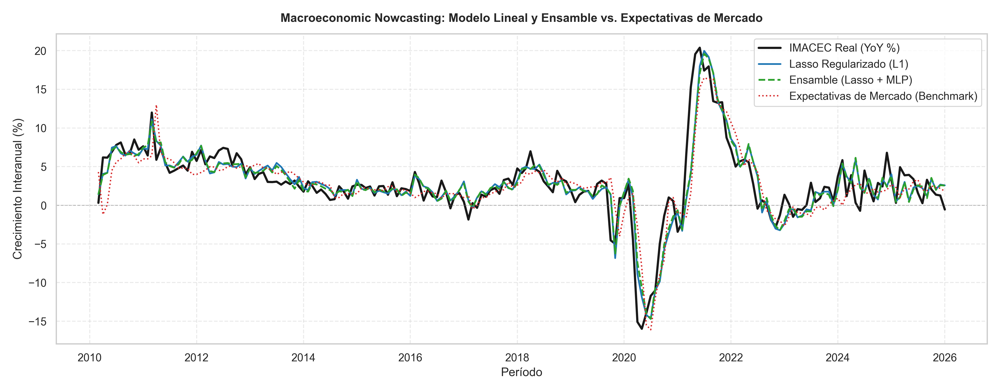

# Macroeconomic Nowcasting: IMACEC (YoY %)

Pipeline de nowcasting para anticipar la actividad económica mensual de Chile (IMACEC en variación interanual) antes de su publicación oficial, combinando modelos lineales regularizados, redes neuronales y ensambles bajo un esquema riguroso sin filtración de datos (*data leakage*).

---

## Metodología Clave

* **Validación Out-of-Sample Estricta:** Backtesting con ventana expansiva (*Expanding Window*) reestimado mes a mes en tiempo real (~190 meses evaluados).
* **Modelos Evaluados:**
  * Modelos lineales regularizados con sintonización dinámica de hiperparámetros (`LassoCV`, `RidgeCV`).
  * Red neuronal perceptrón multicapa (`MLPRegressor`) con regularización $L_2$ y *early stopping* para capturar no-linealidades.
  * Ensamble convexo (*Blending* 50/50 Lasso + MLP).
* **Inferencia Estadística:** Test de Diebold-Mariano con corrección por autocorrelación y heterocedasticidad (Newey-West) frente al benchmark ingenuo (*naive*) y a las Expectativas de Mercado.
* **Interpretabilidad:** Selección dinámica de variables a lo largo del tiempo (mapa de calor de coeficientes $L_1$) y *Permutation Feature Importance* sobre la arquitectura neuronal.

---

## Resultados Fuera de Muestra

Evaluación out-of-sample sobre una ventana expansiva de 191 meses (~16 años de pronósticos en tiempo real):

| Modelo | MAE | RMSE | R² | Dir. Accuracy (%) |
| :--- | :---: | :---: | :---: | :---: |
| **Ensemble (Lasso + MLP)** | **1.415** | 2.118 | 0.798 | 70.16% |
| **LassoCV** | 1.423 | **2.098** | **0.802** | **70.68%** |
| **RidgeCV** | 1.435 | 2.113 | 0.799 | **70.68%** |
| **Red Neuronal (MLP)** | 1.641 | 2.524 | 0.714 | 64.40% |
| *Naive (Random Walk)* | 1.634 | 2.383 | 0.745 | 0.00% |
| *Expectativas de Mercado* | 1.840 | 2.800 | 0.648 | 60.21% |

> **Hallazgos clave:** 
> * El **Ensamble** alcanza el menor error absoluto medio (**MAE: 1.415**), superando con holgura a las Expectativas de Mercado (1.840).
> * **LassoCV** ofrece el mejor balance global (**RMSE: 2.098, R²: 0.802** y **70.68% de precisión direccional**), confirmando el valor de la regularización $L_1$ en series macroeconómicas.
> * Todos los modelos supervisados baten al benchmark del mercado tanto en magnitud de error como en acierto de dirección del ciclo.
## Visualizaciones

### Predicción Fuera de Muestra


### Selección Dinámica de Variables (Lasso Heatmap)


---

## Requisitos y Ejecución

```bash
pip install -r requirements.txt
jupyter notebook notebooks/nowcasting_pipeline.ipynb